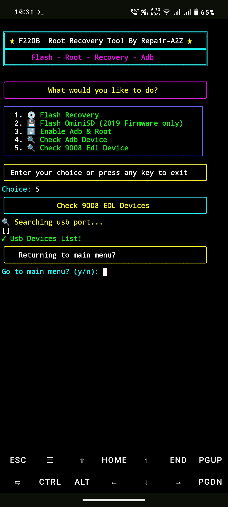

## F220-Recovery-OminiSD-
Install twrp Philz recovery & enable ominisd on  jio f220b Phone Using Termux ```Without PC```
(This Tool Run Only in ```arm64``` architecture Termux Supported mobile) ```Root Required```


Subscribe My YouTube channel 
[Repair A2Z](https://youtube.com/@repaira2z)

## installation :- 

```Install``` [termux](https://f-droid.org/repo/com.termux_1021.apk) & [termux api](https://f-droid.org/repo/com.termux.api_1000.apk) ```apk```
```console
yes | pkg update && upgrade
```
```console
pkg install termux-api
```
```console
pkg install git
```
```console
pkg install libxml2
```
```console
pkg install sudo
```
```console
termux-setup-storage
```
```console
git clone https://github.com/Ishu43642/F220-Recovery-OminiSD-.git
```
```console
cd F220-Recovery-OminiSD-
```
```console
chmod +x qdl && chmod +x f220b.sh && chmod +x delete.sh && chmod +x disable.sh
```

# installation (only for adb option)Termux-Adb :-
[Termux-Adb Fastboot](https://github.com/nohajc/termux-adb) 

```credit :- Termux-Adb``` [nohajc](https://github.com/nohajc)

```console
bash installadb.sh
```

## Run Tool
```console
./f220b.sh
```


# Not:-
1. if your firmware is letest then first downgrade your firmwre ominisd sd not work in letest firmware (recomend version - 110119)

2. Twrp Philz recovery work in all version firmware you don't need to downgrade if you want to install recovery only

3. Create New Folder in internal storage and rename it ```qdl-flash```

4. Download This File - [F220b Recovery ominisd](https://mega.nz/file/IH4DVbgS#oBIvzIWCNPMwtRoScUed6HLp3-douTxpt1b4IicY2Xk) Then Extract it under ```qdl-flash``` folder

5. if you want to downgrade without pc use [Termux-QDL Flasher Tool](https://github.com/Ishu43642/QDL-Flasher)


6. Disable ota update using termux adb in stock rom 
```console
termux-adb shell
```
```console
mount -o remount,rw /system
```
```console
echo '127.0.0.1 fota.mst.kai.jiophone.net' >> /system/etc/hosts
```
```console
echo '127.0.0.1 jioads.akamaized.net' >> /system/etc/hosts
```
```console
echo '127.0.0.1 ssp.kaiads.com' >> /system/etc/hosts
```
```console
sync
```
```console
mount -o remount,ro /system
```
```console
exit
```
```console
termux-adb reboot
```

7. Delete update package 

```console
termux-adb shell
```
```console
cd /data/fota/downloaded
```
```console
rm update.zip
```
```console
cd /data/fota
```
```console
rmdir downloaded
```
```console
exit
```
```console
termux-adb reboot
```